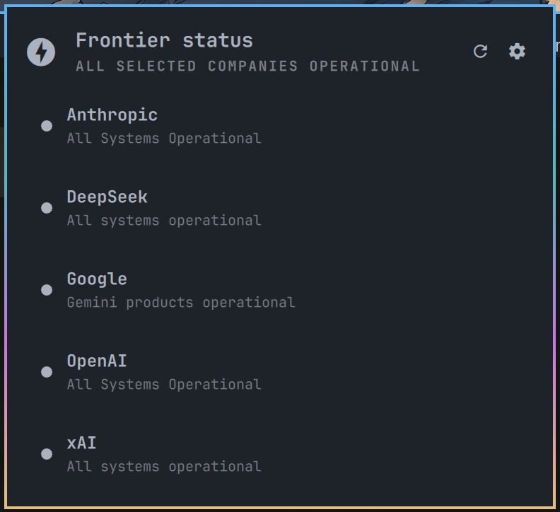

# Ai Frontier Status

A lightning bolt on your Omarchy bar that watches official AI status pages. It goes red when something you enabled is having a bad day.

<p align="center">
  
</p>

## ⚡ What it does

- 📡 Polls only the companies you turn on
- 🔴 Turns the bar icon red when one of them degrades
- 🖱️ Click a row to open that vendor's own status page
- ⏱️ One interval for everyone, 30 seconds to an hour

Every company starts off. Open settings and pick your roster. Official feeds only, no crowd-sourced "is it down" noise.

## 🚀 Install

```sh
omarchy plugin add https://github.com/ollieedgeley/ai-frontier-status.git --enable
```

`--enable` asks which bar section to use. From this checkout, copy the folder into `~/.config/omarchy/plugins/io.github.ollieedgeley.ai-frontier-status/` first. Omarchy will not follow a symlink there.

## 🕹️ Controls

- ⚙️ Gear or `s` for settings
- 🔄 `r` to refresh
- ⎋ Esc to close

## 🗑️ Remove

```sh
omarchy plugin remove io.github.ollieedgeley.ai-frontier-status
```

## ⚖️ License

[MIT](LICENSE) © 2026 Ollie Edgeley
